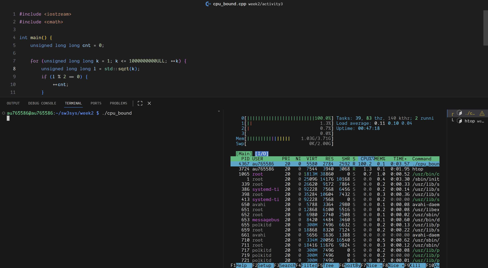
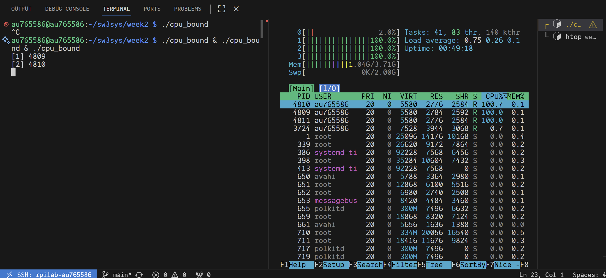
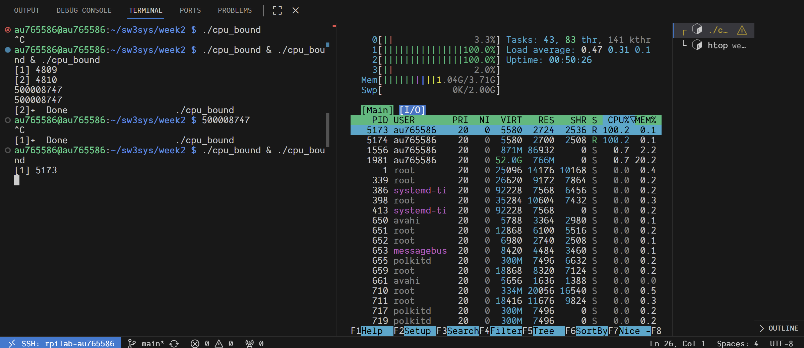
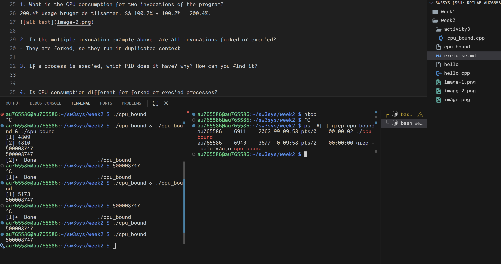

# Exercises
## Activity 2

1. The init process is always the first process started, and gets the PID of '1'. Draw the process tree from 'bash' up to 'init' as it looks when you have just logged into your RPI. You will have to understand how PPIDs (parents) and PIDs (children) are connected to do this.

ps -Af | grep bash får at få første instans og så bevægede vi os baglæns.

- au765586    2063    1553  0 09:04 pts/0    00:00:00 /bin/bash --init-file /home/au765586/.vscode-server-insiders/cli/servers/Insiders-7de43ea56b9b4bfd193263f7523ab7ad9d998d26/server/out/vs/workbench/contrib/terminal/common/scripts/shellIntegration-bash.sh

- au765586    1553    1511  0 09:03 ?        00:00:06 /home/au765586/.vscode-server-insiders/cli/servers/Insiders-7de43ea56b9b4bfd193263f7523ab7ad9d998d26/server/node /home/au765586/.vscode-server-insiders/cli/servers/Insiders-7de43ea56b9b4bfd193263f7523ab7ad9d998d26/server/out/bootstrap-fork --type=ptyHost --logsPath /home/au765586/.vscode-server-insiders/data/logs/20260203T090327

- au765586    1511    1507  0 09:03 ?        00:00:17 /home/au765586/.vscode-server-insiders/cli/servers/Insiders-7de43ea56b9b4bfd193263f7523ab7ad9d998d26/server/node /home/au765586/.vscode-server-insiders/cli/servers/Insiders-7de43ea56b9b4bfd193263f7523ab7ad9d998d26/server/out/server-main.js --connection-token=remotessh --accept-server-license-terms --start-server --enable-remote-auto-shutdown --socket-path=/tmp/code-insiders-5f6ac85a-371c-4b63-8003-316bd50ab3bf

- au765586    1507       1  0 09:03 ?        00:00:00 sh /home/au765586/.vscode-server-insiders/cli/servers/Insiders-7de43ea56b9b4bfd193263f7523ab7ad9d998d26/server/bin/code-server-insiders --connection-token=remotessh --accept-server-license-terms --start-server --enable-remote-auto-shutdown --socket-path=/tmp/code-insiders-5f6ac85a-371c-4b63-8003-316bd50ab3bf

- root           1       0  0 08:59 ?        00:00:03 /sbin/init

## Activity 3

### Step 2

### Step 3

1. What is the CPU consumption for two invocations of the program?
200.4% usage bruger de tilsammen. Så 100.2% + 100.2% = 200.4%.

2. In the multiple invocation example above, are all invocations forked or exec'ed?
- They are forked, so they run in duplicated context

3. If a process is exec'ed, which PID does it have? why? How can you find it?
- I find it using the command ps -Af | grep cpu_bound

4. Is CPU consumption different for forked or exec'ed processes?
- Nej der er ikke forskel i cpu forbrug, da cpu forbruger handler om hvad processerne gør og ikke hvordan de bliver startet.

5. How many parallel invocations of the cpu_bound program, is required before CPU utilization changes? Why?
- Når jeg starter mere end 4, så begynder processerne at dele ressourcer, så hver process får mindre cpu kraft.

6. What Process States are the process working in? Is it the same for any number of parallel invocations? Why?
- They all have the ready/running state (R) contantly, but that both means running and ready.

## Activity 4
1. What is the CPU consumption for a single, and multiple invocation(s) of rd?
- No matter if running a signle process or multiple the process consumption is near 0.
2. With multiple ./rd readers, who receives the data from the FIFO?
- Det er kun den første reader der får input lige meget hvor mange jeg starter.
3. To see the active processes, why is ps -a needed in a different terminal than the one where ./rd & ./rd & was started, but ps alone is sufficient in the same terminal?
- Så på den aktive terminal kan jeg bare skrive ps og på den nye skal jeg bruge ps -a da processerne er tilknyttet den aktive session.
5. What process states does an I/O-bound process go through? Is it always the same? Why?
- De går oftest igennem igennem running og sleeping states.
6. Does kill respect the Process State, so that only a running process can be terminated?
- Nej, kill kan sagtens dræbe en sovende process.
7. Can mkfifo be configured to broadcast incoming data to multiple recipients?
- Nej den supportere ikke broadcast til flere modtagere.
